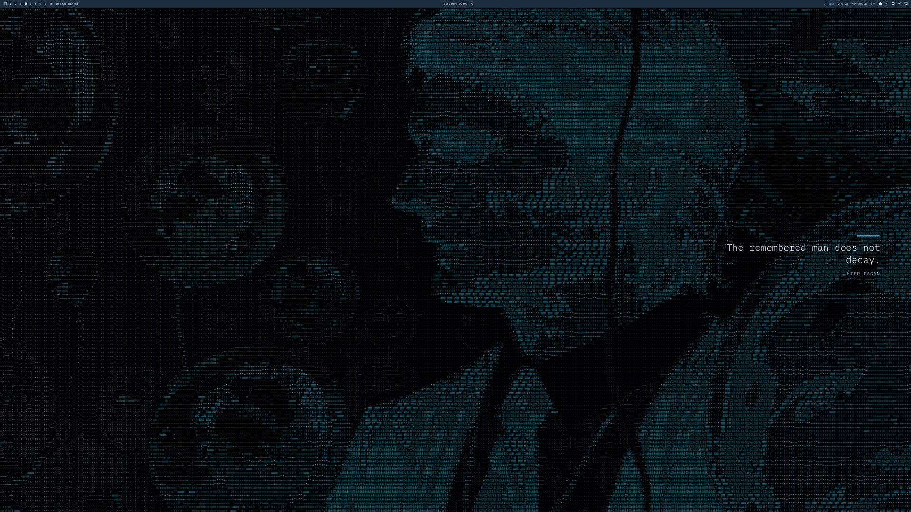

# omarchy-lumon-wallpapers
<!-- lumon-voice:head -->
```
░▒▓█  L U M O N   I N D U S T R I E S  █▓▒░
```
> *The faces of the refiners, so the work need not feel unattended.*
<!-- /lumon-voice:head -->

<!-- lumon-set:start -->
> **Part of [Omarchy · Lumon Industries](https://github.com/KaiCryan/omarchy-lumon)** — a whole-system *Severance* theme for Omarchy.

<details><summary><strong>The full set</strong></summary>

| Repo | |
|---|---|
| [omarchy-lumon](https://github.com/KaiCryan/omarchy-lumon) | **the hub** — install everything, screenshots, the whole pitch |
| [omarchy-lumon-boot](https://github.com/KaiCryan/omarchy-lumon-boot) | Plymouth boot splash — Lumon globe, matching LUKS prompt |
| [omarchy-lumon-lock](https://github.com/KaiCryan/omarchy-lumon-lock) | lock screen — prompts *“Enter your access code”* |
| [omarchy-lumon-greeting](https://github.com/KaiCryan/omarchy-lumon-greeting) | terminal greeting — 19 animations, then `fastfetch` |
| **omarchy-lumon-wallpapers** | real severed-floor stills, opening-titles frames + 4K brand set, hourly cycler &nbsp;·&nbsp; ← you are here |
| [omarchy-lumon-screensaver](https://github.com/KaiCryan/omarchy-lumon-screensaver) | capped-fps `ttfx` effects + an ambient scene reel |
| [omarchy-lumon-theme](https://github.com/KaiCryan/omarchy-lumon-theme) | colour scheme, Hyprland look’n’feel, `fastfetch` + about branding |
| [omarchy-desktop-quote](https://github.com/KaiCryan/omarchy-desktop-quote) | a rotating quote placard over the wallpaper, auto-picks the emptiest side |
| [omarchy-lumon-assets](https://github.com/KaiCryan/omarchy-lumon-assets) | shared ASCII art, fonts and build tools |

</details>
<!-- lumon-set:end -->

<!-- lumon-media:start -->
<div align="center">



<sub>A few of the wallpapers in the set — real severed-floor stills, an opening-titles frame, and the key art. Full list in <a href="wallpapers/SOURCES.md"><code>wallpapers/SOURCES.md</code></a>.</sub>

</div>
<!-- lumon-media:end -->

*Severance* / Lumon Industries wallpapers for [Omarchy](https://omarchy.org),
plus an hourly cycler.

- **`wallpapers/13`** — clean vector-built Lumon brand wallpaper (glow), 4K.
- **`wallpapers/15`** — official *Severance* key art.
- **`wallpapers/20`–`27`** — real *Severance* stills of the severed floor:
  corridors, the elevator, the MDR office. See `wallpapers/SOURCES.md`.
- **`wallpapers/30`** — a real character close-up (Mark), as a photo rather
  than an ASCII portrait.
- **`wallpapers/60`** — a real still from outside the severed floor (Mark's
  outie life).
- **`wallpapers/70`–`75`** — frames from the stop-motion opening titles
  sequence: a different, surreal claymation style from the rest of the set.
  See `wallpapers/SOURCES.md`.
- **`wallpapers/80`–`87`** — eight more real stills, text-free (see below).
- **`quote/`** — `make-quote-wallpaper.sh` composites an eerie Severance quote
  onto a still, Lumon-placard style, if you want to build your own. Not part
  of the live rotation — the [omarchy-desktop-quote](https://github.com/KaiCryan/omarchy-desktop-quote)
  plugin already draws a live quote over whatever wallpaper is showing, so a
  second one baked into the image just meant two quotes at once.

## Install

```sh
git clone https://github.com/KaiCryan/omarchy-lumon-wallpapers
cd omarchy-lumon-wallpapers
./install.sh            # copies wallpapers + enables the hourly cycle
./install.sh --no-cycle # skip the timer
```

Then `omarchy theme bg next` cycles through them (they land in
`~/.config/omarchy/backgrounds/lumon/`).

### Hourly cycle

`install.sh` drops a `wallpaper-cycle.timer` systemd user unit that runs
`omarchy theme bg next` at the top of every hour.

```sh
systemctl --user disable --now wallpaper-cycle.timer   # stop it
# change the cadence: edit OnCalendar= in ~/.config/systemd/user/wallpaper-cycle.timer
```

## Regenerating the character set

Everything is built from `characters/`:

```sh
cd characters
./build.sh
```

Reads `characters.tsv` (`id / src / crop / name / role / dept / quote / sketch`)
and the headshots in `src/`. Add a row + a headshot to add a character; the
`sketch` column (`blur,blackpt,whitept`) tunes the pencil-sketch pass per photo.
Writes the wallpapers to `characters/wallpapers/` and, if
[omarchy-lumon-greeting](https://github.com/KaiCryan/omarchy-lumon-greeting)
is installed, refreshes its `badge` portraits too.

`characters/_portrait.py` (image → ASCII, ImageMagick only) is shared with the
greeting repo. `characters/SOURCES.md` lists every headshot's Wikimedia origin —
used for a personal, non-commercial desktop theme.

## Login theme (optional)

[`login-theme/`](login-theme/) plays the *Severance* main-title theme at login
and lets it ride into the session, with a pause control in the bar. The audio
is copyrighted and not included — you supply your own. See
[`login-theme/README.md`](login-theme/README.md).

```sh
cd login-theme && ./install.sh
lumon-login-theme set-audio ~/Music/severance-main-titles.mp3
```

## Uninstall

```sh
./uninstall.sh
```

## Requires

ImageMagick, and the fonts Michroma / IBM Plex Sans / a mono Nerd Font
(resolved through `fontconfig`; falls back to generic families).

---

<div align="center"><sub>

*The work is mysterious and important.*

Part of [Omarchy · Lumon Industries](https://github.com/KaiCryan/omarchy-lumon) · a personal, non-commercial *Severance* tribute · not affiliated with Apple TV+

</sub></div>
<!-- lumon-voice:footer -->
